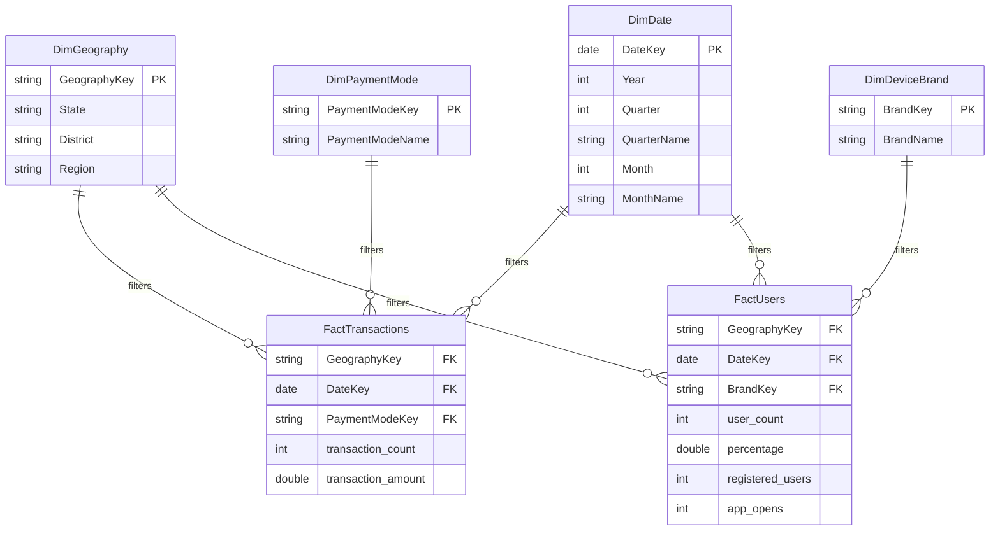

# PhonePe Payment Insights - Power BI Implementation Guide

This guide details the steps to build, model, and optimize a professional, enterprise-grade Power BI dashboard using the PhonePe Pulse dataset.

---

## 1. Data Architecture & Modeling (STAR Schema)

To ensure maximum performance and write simple DAX expressions, the relational data is modeled using a **Star Schema** layout.

### Relational Schema Diagram


### Relationship Cardinalities
-   `DimGeography` to `FactTransactions`: One-to-Many (`1:*`), single cross-filter direction.
-   `DimDate` to `FactTransactions`: One-to-Many (`1:*`), single cross-filter direction.
-   `DimPaymentMode` to `FactTransactions`: One-to-Many (`1:*`), single cross-filter direction.
-   `DimGeography` to `FactUsers`: One-to-Many (`1:*`), single cross-filter direction.
-   `DimDate` to `FactUsers`: One-to-Many (`1:*`), single cross-filter direction.
-   `DimDeviceBrand` to `FactUsers`: One-to-Many (`1:*`), single cross-filter direction.

---

## 2. Core Business Metrics (DAX Measures)

Implement these measures in your Power BI model. Always store calculations in Measures rather than Calculated Columns for speed.

### Basic Aggregations
```dax
-- Total Transaction Value (Amount)
Total Transaction Amount = SUM(FactTransactions[transaction_amount])

-- Total Transaction Count
Total Transaction Count = SUM(FactTransactions[transaction_count])

-- Average Ticket Size
Average Ticket Size = DIVIDE([Total Transaction Amount], [Total Transaction Count], 0)
```

### Time Intelligence Calculations
> [!IMPORTANT]
> Time intelligence functions require a marked, contiguous **Calendar/Date Table** connected to the Fact tables.

```dax
-- Year-to-Date (YTD) Transaction Amount
Amount_YTD = TOTALYTD([Total Transaction Amount], 'DimDate'[DateKey])

-- Quarter-to-Date (QTD) Transaction Amount
Amount_QTD = TOTALQTD([Total Transaction Amount], 'DimDate'[DateKey])

-- Month-to-Date (MTD) Transaction Amount
Amount_MTD = TOTALMTD([Total Transaction Amount], 'DimDate'[DateKey])
```

### Growth & Variance Metrics
```dax
-- Previous Quarter Transaction Amount
Amount_Prev_Quarter = 
CALCULATE(
    [Total Transaction Amount],
    DATEADD('DimDate'[DateKey], -1, QUARTER)
)

-- Quarter-over-Quarter (QoQ) Growth Percentage
QoQ_Growth_Percent = 
VAR CurrentAmt = [Total Transaction Amount]
VAR PrevAmt = [Amount_Prev_Quarter]
RETURN
    DIVIDE(CurrentAmt - PrevAmt, PrevAmt, 0)
```

---

## 3. Row-Level Security (RLS) Implementation

To control data access (e.g., ensuring a Regional Manager for "North India" only sees North Indian states), define roles using DAX rules.

### Dynamic RLS Setup (Recommended)
1.  Create an enteprise mapping table `DimUserRoles` that maps users to their allowed states:
    -   `Email` (e.g., manager@phonepe.com)
    -   `State` (e.g., Delhi)
2.  Import this table and join it to `DimGeography` on `State` (set cross-filtering to **Both** directions and check **Apply security filter in both directions**).
3.  Under **Modeling** -> **Manage Roles**, create a role named `RegionalManager`.
4.  Add a DAX filter to `DimUserRoles`:
    ```dax
    [Email] = USERPRINCIPALNAME()
    ```
5.  When a user logs in, Power BI Service will resolve `USERPRINCIPALNAME()` to their email address and filter the geography dimension, dynamically slicing the report facts.

### Static RLS Setup
If mapping tables are not used, you can define static regional filters:
-   **Role:** `SouthIndiaManager`
-   **Filter on DimGeography:**
    ```dax
    [State] IN { "Karnataka", "Tamil Nadu", "Andhra Pradesh", "Telangana", "Kerala" }
    ```

---

## 4. Performance Optimization Checklist

If a Power BI report runs slowly, perform these tuning steps:

1.  **Reduce Column Footprint (Vertical Filtering):**
    -   Do not load columns you do not need (e.g., raw JSON keys, indices, secondary timestamps). Delete them in **Power Query** to reduce model size in memory.
2.  **Optimize Cardinality (Disable Auto Date/Time):**
    -   Turn off **Auto Date/Time** in File Options. Auto Date/Time creates hidden calendar tables for every date field, bloating file size. Use a single central custom `DimDate` table instead.
3.  **Optimize DAX Calculations:**
    -   Use `DIVIDE()` instead of `/`. `DIVIDE` handles zero division errors automatically and is more performant.
    -   Use **Variables (`VAR / RETURN`)** to store intermediate calculations. This prevents evaluating the same measure multiple times in a single formula.
4.  **Import vs DirectQuery Choice:**
    -   Use **Import Mode** for the PhonePe Pulse dataset. The size is ~100MB, which fits easily. Import mode utilizes the in-memory VertiPaq compression engine, making visual render times instantaneous.
5.  **Use Performance Analyzer:**
    -   Go to **View** -> **Performance Analyzer** in Desktop. Start recording and refresh visuals. Identify which visual has a long DAX query time and optimize its measures.
